## 📋 이벤트 정의

| 이벤트 | 발행 시점 | 발행자 | 수신자 |
| --- | --- | --- | --- |
| `TripPlanGenerationRequestedEvent` | 사용자가 일정 생성 요청 시 | Chat 서비스 | AI 리스너 |
| `DailyPlanGeneratedEvent` | 일차별 일정 완성 시 | AI 서비스 | Chat 리스너 |
| `TripGenerationCompletedEvent` | 전체 일정 완성 시 | AI 서비스 | Chat 리스너 |
| `TripGenerationErrorEvent` | 일정 생성 오류 발생 시 | AI 서비스 | Chat 리스너 |
| `StreamCancellationRequestedEvent` | WebSocket 연결 해제 시 | Chat 서비스 | AI 리스너 |

---

## 📦 이벤트 데이터

- **TripPlanGenerationRequestedEvent**
    - `sessionId` (String): WebSocket 세션 ID
    - `chatRoomId` (Long): 채팅방 ID
    - `tripPlanRequest` (TripPlanRequest): 여행 일정 생성 요청
        - `tripThemeId` (Long): 여행 테마 ID
        - `title` (String): 여행 제목
        - `startDate` (LocalDate): 여행 시작일
        - `endDate` (LocalDate): 여행 종료일
        - `region` (String): 선호 도시 (서울, 경기, 제주 등)
        - `transportation` (Transportation): 선호 이동 방식 (NONE, WALKING, PUBLIC_TRANSIT, CAR)
        - `budget` (String): 예산 수준
        - `peopleCount` (Integer): 여행 인원 수
        - `startLocation` (Location): 출발지 정보
            - `name` (String): 장소 이름
            - `address` (String): 주소
            - `point` (Point): 좌표
        - `endLocation` (Location): 도착지 정보
            - `name` (String): 장소 이름
            - `address` (String): 주소
            - `point` (Point): 좌표
- **DailyPlanGeneratedEvent**
    - `sessionId` (String): WebSocket 세션 ID
    - `chatRoomId` (Long): 채팅방 ID
    - `tripPlanId` (Long): 여행 계획 ID (TripPlan 엔티티)
    - `dayNumber` (int): 일차 번호 (1, 2, 3, …)
    - `dailyPlanData` (DailyPlanData): 생성된 일정 데이터
        - `date` (LocalDate): 일정 날짜
        - `scheduledPlaces` (List<ScheduledPlaceData>): 방문 장소 목록
            - `placeId` (Long): 방문할 장소 ID
            - `visitOrder` (Integer): 방문 순서
            - `category` (ScheduledCategory): 일정 분류 (MORNING, LUNCH, AFTERNOON, CAFE, DINNER, EVENING)
            - `plannedTime` (LocalTime): 계획된 방문 시간
            - `travelSegment` (TravelSegment): 이동 정보
                - `travelTime` (Integer): 예상 이동 시간 (분)
                - `transportation` (Transportation): 이동 수단
- **TripGenerationCompletedEvent**
    - `sessionId` (String): WebSocket 세션 ID
    - `chatRoomId` (Long): 채팅방 ID
    - `tripPlanId` (Long): 여행 계획 ID (TripPlan 엔티티)
    - `totalDays` (int): 전체 여행 일수 (박수 기준)
- **TripGenerationErrorEvent**
    - `sessionId` (String): WebSocket 세션 ID
    - `chatRoomId` (Long): 채팅방 ID
    - `errorMessage` (String): 에러 메시지
    - `errorCode` (ErrorCode): 에러 코드
- **StreamCancellationRequestedEvent**
    - `sessionId` (String): WebSocket 세션 ID

---

## 🔄 전체 시퀀스 다이어그램

전체 흐름을 한눈에 파악할 수 있는 다이어그램입니다.

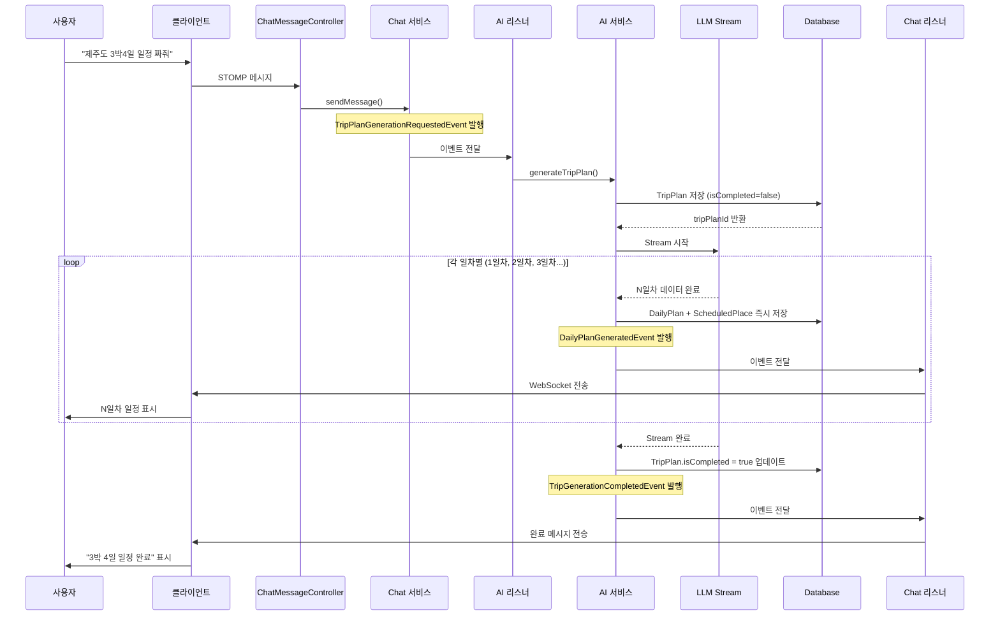

---

## 📤 이벤트 발행 상세

각 이벤트가 어떻게 발행되는지 상세한 다이어그램입니다.

### 1️⃣ TripPlanGenerationRequestedEvent 발행

사용자 요청을 받아 Chat 서비스에서 이벤트를 발행합니다.

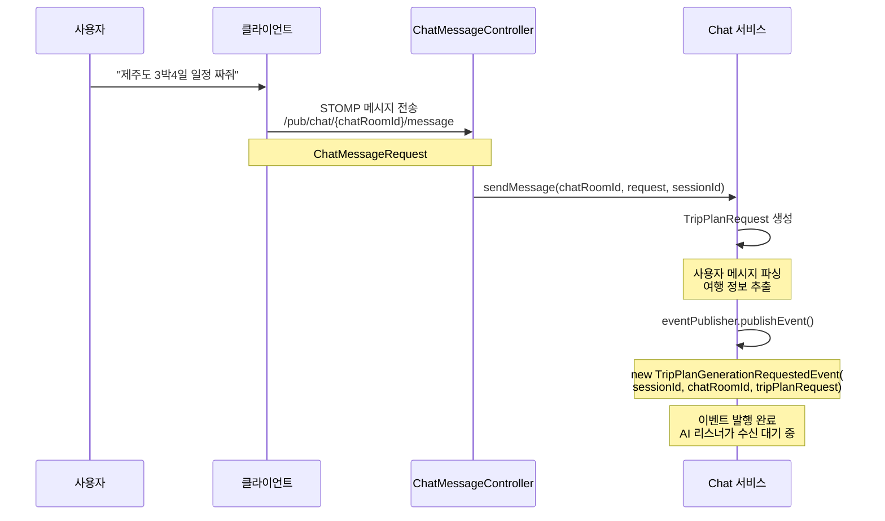

---

### 2️⃣ DailyPlanGeneratedEvent 발행

LLM이 일차별 데이터를 생성하면 즉시 DB에 저장하고 이벤트를 발행합니다.

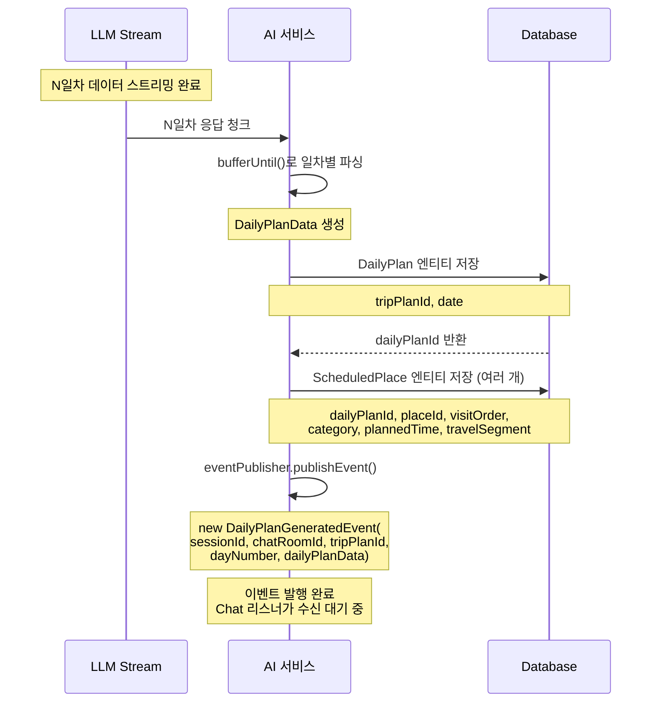

---

### 3️⃣ TripGenerationCompletedEvent 발행

모든 일차 스트리밍이 완료되면 TripPlan을 완료 상태로 업데이트하고 이벤트를 발행합니다.

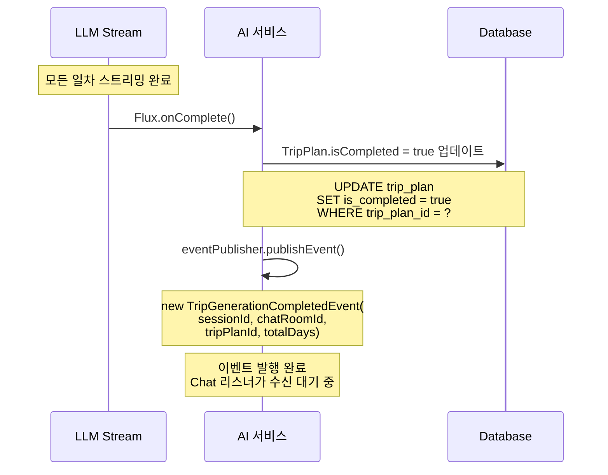

---

### 4️⃣ TripGenerationErrorEvent 발행

스트리밍 중 오류가 발생하면 에러 이벤트를 발행합니다.

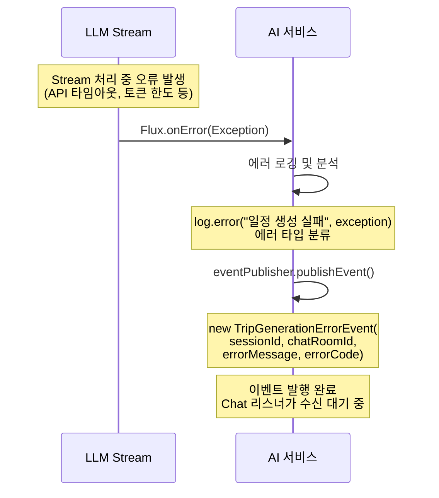

---

## 📥 이벤트 수신 및 처리 상세

각 이벤트를 수신한 후 어떻게 처리하는지 상세한 다이어그램입니다.

### 1️⃣ TripPlanGenerationRequestedEvent 수신 및 처리

AI 리스너가 이벤트를 수신하여 여행 일정 생성을 시작합니다.

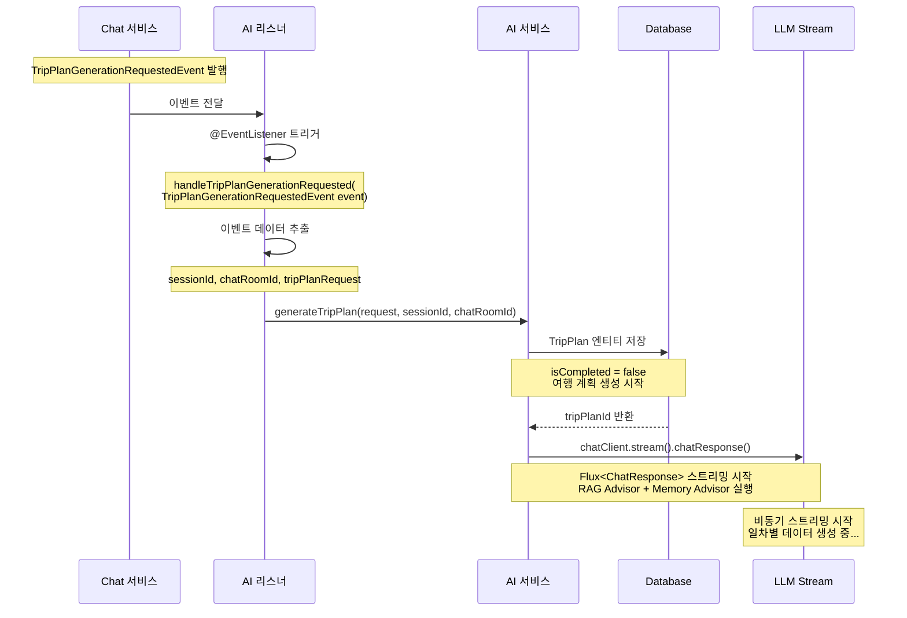

---

### 2️⃣ DailyPlanGeneratedEvent 수신 및 처리

Chat 리스너가 이벤트를 수신하여 클라이언트에게 일차별 일정을 전송합니다.

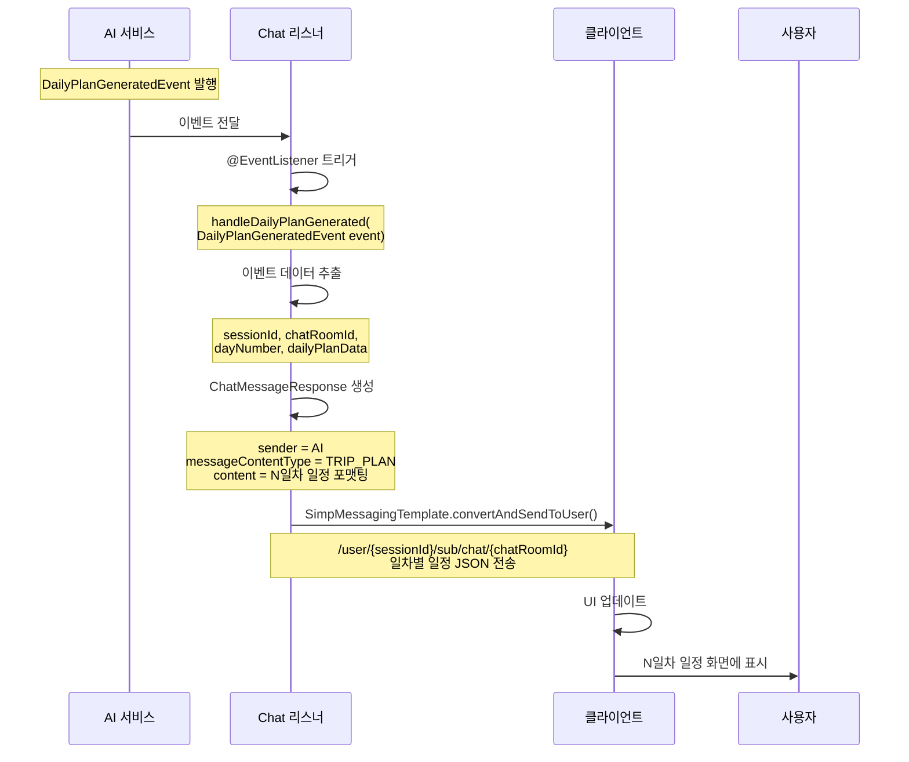

---

### 3️⃣ TripGenerationCompletedEvent 수신 및 처리

Chat 리스너가 완료 이벤트를 수신하여 완료 메시지를 전송합니다.

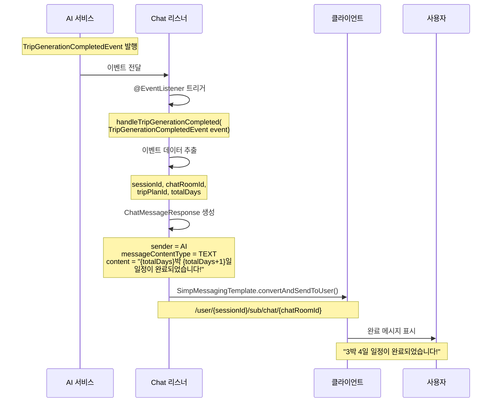

---

### 4️⃣ TripGenerationErrorEvent 수신 및 처리

Chat 리스너가 에러 이벤트를 수신하여 에러 메시지를 전송합니다.

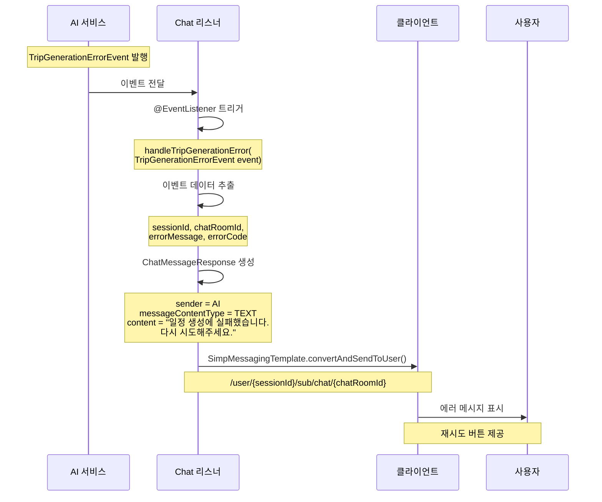

---

## 🔌 WebSocket 연결 해제 시 처리

### 전체 흐름

사용자가 연결을 끊으면 진행 중인 스트리밍을 취소합니다.

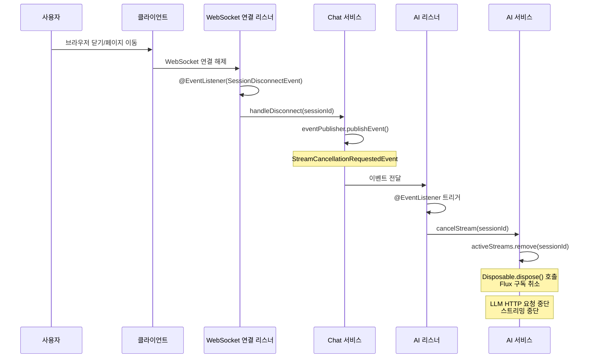

---

### 📤 StreamCancellationRequestedEvent 발행

WebSocket 연결이 해제되면 Chat 서비스가 Stream 취소 이벤트를 발행합니다.

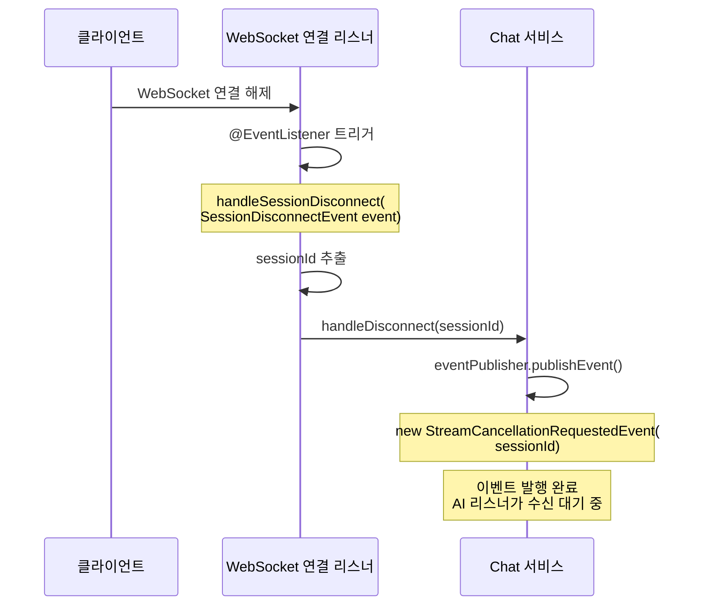

---

### 📥 StreamCancellationRequestedEvent 수신 및 처리

AI 리스너가 이벤트를 수신하여 진행 중인 Stream을 취소합니다.

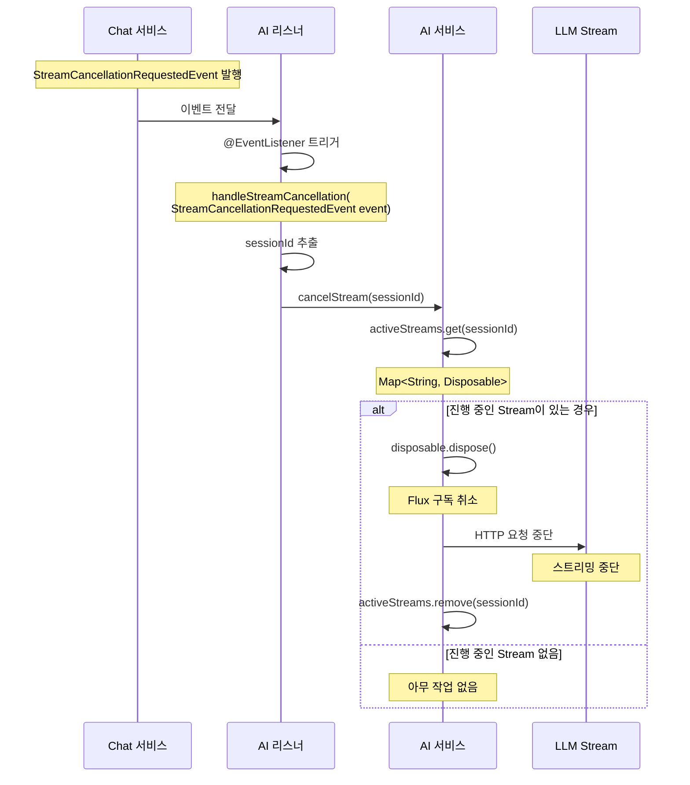