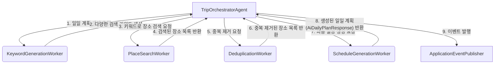

# TripAgent Orchestrator-Worker 패턴 전환 가이드

## 1. 서론

이 문서는 현재 `TripAgent`가 가진 **"항상 비슷한 장소만 추천하는 문제"**를 해결하고, 더 유연하고 확장 가능한 구조로 개선하기 위해 **오케스트레이터-워커(Orchestrator-Worker) 패턴**을 적용하는 구체적인 방법을 안내합니다.

제공된 `agent.md`, `agent2.md` 문서의 아이디어를 기반으로, 현재 프로젝트(`airoad-backend`)의 코드베이스에 실제로 적용할 수 있는 단계별 가이드라인과 코드 예시를 제공합니다.

---

## 2. 핵심 문제 분석: 왜 항상 같은 장소를 추천할까?

현재 `TripAgent`의 `generateDailyPlan` 메서드 내부 로직을 살펴보면 문제의 원인을 명확히 알 수 있습니다.

**`TripAgent.java`의 일부:**
```java
PlaceVectorQueryContext placeVectorPlaceQueryContext =
    PlaceVectorQueryContext.builder()
        .queryType(QueryType.PLACE)
        .searchRequest(
            SearchRequest.builder()
                .query(
                    "%s에 있는 %s 테마에 어울리는 장소를 찾고 싶어요." // <- 문제의 원인!
                        .formatted(
                            request.region(),
                            request.themes().stream()
                                .map(PlaceThemeType::getDescription)
                                .collect(Collectors.joining(", "))))
                .topK(10)
                .similarityThreshold(0.45d)
                .build())
        .build();
```

- **정적인 쿼리 문장**: 벡터 검색 시 항상 `"서울에 있는 감성, 카페 테마에 어울리는 장소를 찾고 싶어요."` 와 같이 동일한 형식의 쿼리를 사용합니다.
- **예측 가능한 결과**: 동일한 쿼리는 벡터 저장소에서 거의 항상 동일한 상위 N개의 결과(장소)를 반환합니다.
- **반복적인 일정**: AI 모델은 매번 같은 장소 목록을 컨텍스트로 받기 때문에, 결과적으로 생성되는 여행 일정이 단조롭고 반복될 수밖에 없습니다.

이 문제를 해결하기 위해, 매일 일정을 생성할 때마다 **동적으로 다양한 검색어를 생성**하고, **결과를 조합**하는 과정이 필요합니다. 이것이 바로 오케스트레이터-워커 패턴이 필요한 이유입니다.

---

## 3. 제안 아키텍처: Orchestrator-Worker 패턴 도입

기존의 거대한 `TripAgent`를 여러 개의 전문화된 `Worker`로 분리하고, 이들을 총괄하는 `Orchestrator`를 도입합니다.

 
*(위 이미지는 설명을 위한 예시입니다. 실제 다이어그램은 아래와 같습니다.)*



### 3.1. 컴포넌트별 역할 정의

| 컴포넌트                      | 역할                                                                                                                                                           | 구현 방식                               |
| ----------------------------- | -------------------------------------------------------------------------------------------------------------------------------------------------------------- | --------------------------------------- |
| **TripOrchestratorAgent**     | 전체 프로세스를 총괄하는 오케스트레이터. 각 Worker를 순차적으로 호출하고 데이터를 전달하며, 일일 계획 생성을 지휘한다. 기존 `TripAgent`의 `execute` 로직을 대체한다. | `AiroadAgent`를 구현하는 새로운 Agent 클래스 |
| **KeywordGenerationWorker**   | 여행 조건(지역, 테마, 날짜)을 바탕으로 LLM을 이용해 창의적이고 다양한 벡터 검색용 키워드(예: "서울 노을 맛집", "조용한 골목길 산책")를 3~5개 생성한다. **가장 핵심적인 워커**. | LLM 호출을 포함한 서비스 클래스         |
| **PlaceSearchWorker**         | `KeywordGenerationWorker`가 생성한 키워드들을 받아, 각 키워드에 대해 `VectorStore`에서 장소를 검색한다. `PlaceVectorQueryContextProvider`를 내부적으로 활용한다.      | `VectorStore`를 사용하는 서비스 클래스    |
| **DeduplicationWorker**       | 검색된 장소 목록과 이전에 방문했던 장소 목록을 비교하여 중복을 제거한다. `TripPlanQueryContextProvider`를 활용하여 이전 방문 기록을 가져올 수 있다.                 | 순수 Java 로직으로 구현된 서비스 클래스   |
| **ScheduleGenerationWorker**  | 중복이 제거된 최종 장소 목록을 컨텍스트로 받아, LLM에게 하루 일정을 생성하도록 요청한다. 기존 `TripAgent`의 최종 LLM 호출 부분과 유사하다.                         | LLM 호출을 포함한 서비스 클래스         |
| **Context Providers**         | (`SystemPrompt~`, `TripPlanQuery~` 등) 기존의 컨텍스트 프로바이더들은 변경 없이 각 워커에서 재사용 가능하다. 역할이 명확히 분리되어 있어 재사용성이 높다.         | 변경 없음                               |

---

## 4. 단계별 구현 가이드

### Step 1: Worker 인터페이스 및 DTO 정의

먼저 각 워커들의 입출력을 명확히 하기 위해 DTO(Data Transfer Object)를 정의합니다. `record` 타입을 사용하면 불변 객체를 간편하게 만들 수 있습니다.

```java
// src/main/java/com/swygbro/airoad/backend/ai/worker/dto/WorkerDTO.java (예시 경로)

public final class WorkerDTO {

    // KeywordGenerationWorker 입력
    public record KeywordGenerationRequest(String region, List<String> themes, int peopleCount) {}

    // KeywordGenerationWorker 출력
    public record KeywordGenerationResponse(List<String> keywords) {}

    // PlaceSearchWorker 입력
    public record PlaceSearchRequest(List<String> keywords, String region) {}

    // PlaceSearchWorker 출력 (Document는 Spring AI의 클래스)
    public record PlaceSearchResponse(List<Document> documents) {}

    // DeduplicationWorker 입력
    public record DeduplicationRequest(List<Document> candidates, Long tripPlanId, String username) {}

    // DeduplicationWorker 출력
    public record DeduplicationResponse(List<Document> filteredPlaces) {}

    // ScheduleGenerationWorker 입력
    public record ScheduleGenerationRequest(
        List<Document> places,
        AiDailyPlanRequest originalRequest, // 기존 요청 정보 재활용
        int dayNumber
    ) {}
}
```

### Step 2: 각 Worker 클래스 구현

#### 1. `KeywordGenerationWorker` 구현
LLM을 호출하여 검색어를 생성하는 가장 중요한 워커입니다.

```java
// src/main/java/com/swygbro/airoad/backend/ai/worker/KeywordGenerationWorker.java

@Component
@RequiredArgsConstructor
public class KeywordGenerationWorker {

    private final ChatClient chatClient;
    private final ContextManager contextManager; // 시스템 프롬프트 등을 위해 사용

    public KeywordGenerationResponse execute(KeywordGenerationRequest request) {
        // 1. 이 워커를 위한 전용 프롬프트 준비 (DB 또는 리소스 파일)
        // 예: "다음 여행 조건에 맞는 창의적인 검색어 5개를 JSON 배열 형태로 제안해줘: 지역={region}, 테마={themes}"
        
        // 2. ContextManager로 필요한 시스템 프롬프트 등 빌드
        List<MetadataEntry> context = contextManager.buildContext(AgentType.KEYWORD_GENERATION_AGENT /* 새로운 AgentType 추가 */);

        // 3. LLM 호출
        return chatClient.prompt()
                .user(u -> u.text("지역: {region}, 테마: {themes} 기반 검색어 생성") // 실제로는 프롬프트 템플릿 사용
                              .param("region", request.region())
                              .param("themes", String.join(", ", request.themes())))
                .advisors(a -> a.param(PromptMetadataAdvisor.METADATA_KEY, context))
                .call()
                .entity(KeywordGenerationResponse.class); // JSON 출력을 클래스로 자동 변환
    }
}
```
> **팁:** `KeywordGenerationWorker`를 위한 `AgentType`을 새로 정의하고, DB에 전용 프롬프트를 등록하여 관리하면 유지보수가 용이합니다.

#### 2. `PlaceSearchWorker` 구현
LLM 호출 없이, 주어진 키워드로 `VectorStore`를 검색합니다.

```java
// src/main/java/com/swygbro/airoad/backend/ai/worker/PlaceSearchWorker.java

@Component
@RequiredArgsConstructor
public class PlaceSearchWorker {

    private final VectorStore vectorStore;

    public PlaceSearchResponse execute(PlaceSearchRequest request) {
        List<Document> allDocuments = request.keywords().stream()
                .flatMap(keyword -> {
                    SearchRequest searchRequest = SearchRequest.builder()
                            .query(keyword)
                            .topK(5) // 키워드당 5개씩
                            .similarityThreshold(0.45d)
                            .build();
                    return vectorStore.similaritySearch(searchRequest).stream();
                })
                .distinct() // Document ID 기반 중복 제거
                .collect(Collectors.toList());

        return new PlaceSearchResponse(allDocuments);
    }
}
```

#### 3. `DeduplicationWorker` 구현
순수 Java 로직으로 중복을 제거합니다.

```java
// src/main/java/com/swygbro/airoad/backend/ai/worker/DeduplicationWorker.java

@Component
@RequiredArgsConstructor
public class DeduplicationWorker {

    private final TripPlanQueryUseCase tripPlanQueryUseCase; // 기존 여행 계획 조회

    public DeduplicationResponse execute(DeduplicationRequest request) {
        if (request.tripPlanId() == null) {
            return new DeduplicationResponse(request.candidates());
        }

        // 1. 기존 여행 계획에서 방문했던 장소 ID 목록 조회
        TripPlanDetailsResponse tripPlan = tripPlanQueryUseCase.findTripPlanDetailsById(request.tripPlanId(), request.username());
        Set<Long> visitedPlaceIds = tripPlan.dailyPlans().stream()
                .flatMap(dailyPlan -> dailyPlan.scheduledPlaces().stream())
                .map(place -> place.place().id())
                .collect(Collectors.toSet());

        // 2. 후보 장소 목록에서 방문했던 장소 필터링
        List<Document> filteredPlaces = request.candidates().stream()
                .filter(doc -> {
                    Long placeId = Long.parseLong(doc.getMetadata().get("placeId").toString());
                    return !visitedPlaceIds.contains(placeId);
                })
                .toList();

        return new DeduplicationResponse(filteredPlaces);
    }
}
```

#### 4. `ScheduleGenerationWorker` 구현
최종 후보 장소들로 일정을 생성합니다. 기존 `TripAgent`의 `generateDailyPlan` 후반부와 유사합니다.

```java
// src/main/java/com/swygbro/airoad/backend/ai/worker/ScheduleGenerationWorker.java

@Component
@RequiredArgsConstructor
public class ScheduleGenerationWorker {

    private final ChatClient chatClient;
    private final ContextManager contextManager;

    public AiDailyPlanResponse execute(ScheduleGenerationRequest request) {
        // 1. 최종 장소 목록을 컨텍스트로 변환
        String placesContext = request.places().stream()
            .map(this::formatDocument) // formatDocument는 Document를 문자열로 변환하는 헬퍼 메서드
            .collect(Collectors.joining("\n\n"));

        // 2. 기존 ContextProvider들을 활용하여 전체 컨텍스트 빌드
        // TripPlanCommandContext, TripPlanQueryContext 등 기존 DTO 재활용
        List<MetadataEntry> contextMetadata = contextManager.buildContext(
            AgentType.TRIP_AGENT, // 또는 새로운 AgentType
            // ... 기존 컨텍스트 DTO들 ...
            PromptMetadataAdvisor.systemMetadata("## 추천 장소 목록\n" + placesContext) // 최종 장소 목록 주입
        );

        String daySpecificPrompt = String.format("%d일차 여행 일정을 생성해주세요.", request.dayNumber());

        // 3. LLM 호출하여 최종 일정 생성
        return chatClient.prompt()
                .user(daySpecificPrompt)
                .advisors(a -> a.param(PromptMetadataAdvisor.METADATA_KEY, contextMetadata))
                .call()
                .entity(AiDailyPlanResponse.class);
    }
    
    private String formatDocument(Document doc) {
        // PlaceVectorQueryContextProvider의 formatDocumentWithMetadata와 유사하게 구현
        return "[장소ID: %s] 이름: %s, 설명: %s".formatted(
            doc.getMetadata().get("placeId"),
            doc.getMetadata().get("name"),
            doc.getContent()
        );
    }
}
```

### Step 3: `TripOrchestratorAgent` 구현

이제 워커들을 지휘할 오케스트레이터를 만듭니다.

```java
// src/main/java/com/swygbro/airoad/backend/ai/agent/trip/TripOrchestratorAgent.java

@Slf4j
@Component
@RequiredArgsConstructor
public class TripOrchestratorAgent implements AiroadAgent {

    private final AgentType agentType = AgentType.TRIP_AGENT; // 이 Agent가 기존 TripAgent를 대체
    private final ApplicationEventPublisher eventPublisher;
    
    // 워커들 주입
    private final KeywordGenerationWorker keywordGenerationWorker;
    private final PlaceSearchWorker placeSearchWorker;
    private final DeduplicationWorker deduplicationWorker;
    private final ScheduleGenerationWorker scheduleGenerationWorker;

    @Override
    public boolean supports(AgentType agentType) {
        return this.agentType == agentType;
    }

    @Override
    public void execute(Object data) {
        AiDailyPlanRequest request = (AiDailyPlanRequest) data;
        log.info("오케스트레이터 기반 여행 일정 생성 시작 - TripPlanId: {}", request.tripPlanId());

        try {
            for (int dayNumber = 1; dayNumber <= request.duration(); dayNumber++) {
                log.debug("{}일차 일정 생성 시작", dayNumber);

                // Worker 순차 실행
                // 1. 키워드 생성
                var keywordReq = new WorkerDTO.KeywordGenerationRequest(request.region(), request.themes().stream().map(PlaceThemeType::getDescription).toList(), request.peopleCount());
                var keywordRes = keywordGenerationWorker.execute(keywordReq);
                log.debug("{}일차 생성된 키워드: {}", dayNumber, keywordRes.keywords());

                // 2. 장소 검색
                var searchReq = new WorkerDTO.PlaceSearchRequest(keywordRes.keywords(), request.region());
                var searchRes = placeSearchWorker.execute(searchReq);

                // 3. 중복 제거
                var dedupReq = new WorkerDTO.DeduplicationRequest(searchRes.documents(), request.tripPlanId(), request.username());
                var dedupRes = deduplicationWorker.execute(dedupReq);
                log.debug("{}일차 후보 장소 {}개 -> 중복 제거 후 {}개", dayNumber, searchRes.documents().size(), dedupRes.filteredPlaces().size());

                // 4. 최종 일정 생성
                var scheduleReq = new WorkerDTO.ScheduleGenerationRequest(dedupRes.filteredPlaces(), request, dayNumber);
                AiDailyPlanResponse dailyPlan = scheduleGenerationWorker.execute(scheduleReq);

                // 5. 이벤트 발행 (기존과 동일)
                publishDailyPlanEvent(request, dailyPlan);
                log.info("{}일차 일정 생성 완료", dayNumber);
            }

            publishCompletionEvent(request);
            log.info("여행 일정 전체 생성 완료 - 총 {}일", request.duration());

        } catch (Exception e) {
            log.error("AI 일정 생성 중 오류 발생", e);
            publishErrorEvent(request, e);
        }
    }

    // publishDailyPlanEvent, publishCompletionEvent, publishErrorEvent 메서드는 기존 TripAgent에서 그대로 가져와 재사용
    // ...
}
```

### Step 4: 설정 및 리팩토링

1.  **`AgentType` 추가**: `KeywordGenerationWorker` 등 LLM을 사용하는 워커를 위해 `AgentType` enum에 새로운 타입을 추가하는 것을 고려해볼 수 있습니다. (예: `KEYWORD_GENERATION_AGENT`)
2.  **`TripAgent` 대체**: `TripOrchestratorAgent`가 준비되면, 기존 `TripAgent` 클래스는 삭제하거나 `@Component` 어노테이션을 제거하여 비활성화합니다. `AiroadAgent`를 찾는 로직이 `TripOrchestratorAgent`를 선택하도록 합니다.
3.  **`ContextProvider` 재사용**: 각 워커는 필요한 컨텍스트 DTO를 생성하여 `ContextManager`를 호출하면 됩니다. 기존 `ContextProvider`들은 수정 없이 대부분 재사용 가능합니다.

---

## 5. 결론

오케스트레이터-워커 패턴을 적용함으로써 얻는 이점은 다음과 같습니다.

-   **결과 다양성 확보**: `KeywordGenerationWorker` 덕분에 매번 새로운 장소를 탐색하여 단조로운 추천 문제를 근본적으로 해결합니다.
-   **명확한 역할 분리**: 각 워커는 하나의 책임만 가집니다. 코드를 이해하고 테스트하기 쉬워집니다.
-   **유연성 및 확장성**: "맛집 추천 강화", "액티비티 추천 추가" 등 새로운 기능이 필요할 때, 해당 기능에만 집중하는 새로운 워커를 만들어 파이프라인에 추가하기만 하면 됩니다.
-   **유지보수 용이성**: 특정 단계(예: 장소 검색)의 로직을 개선하고 싶을 때, 해당 워커만 수정하면 되므로 변경의 영향 범위가 명확하고 적습니다.

이 가이드를 통해 `TripAgent`를 성공적으로 개선하여 사용자에게 더욱 만족스러운 여행 일정을 제공하는 AI 서비스로 발전시키기를 바랍니다.
